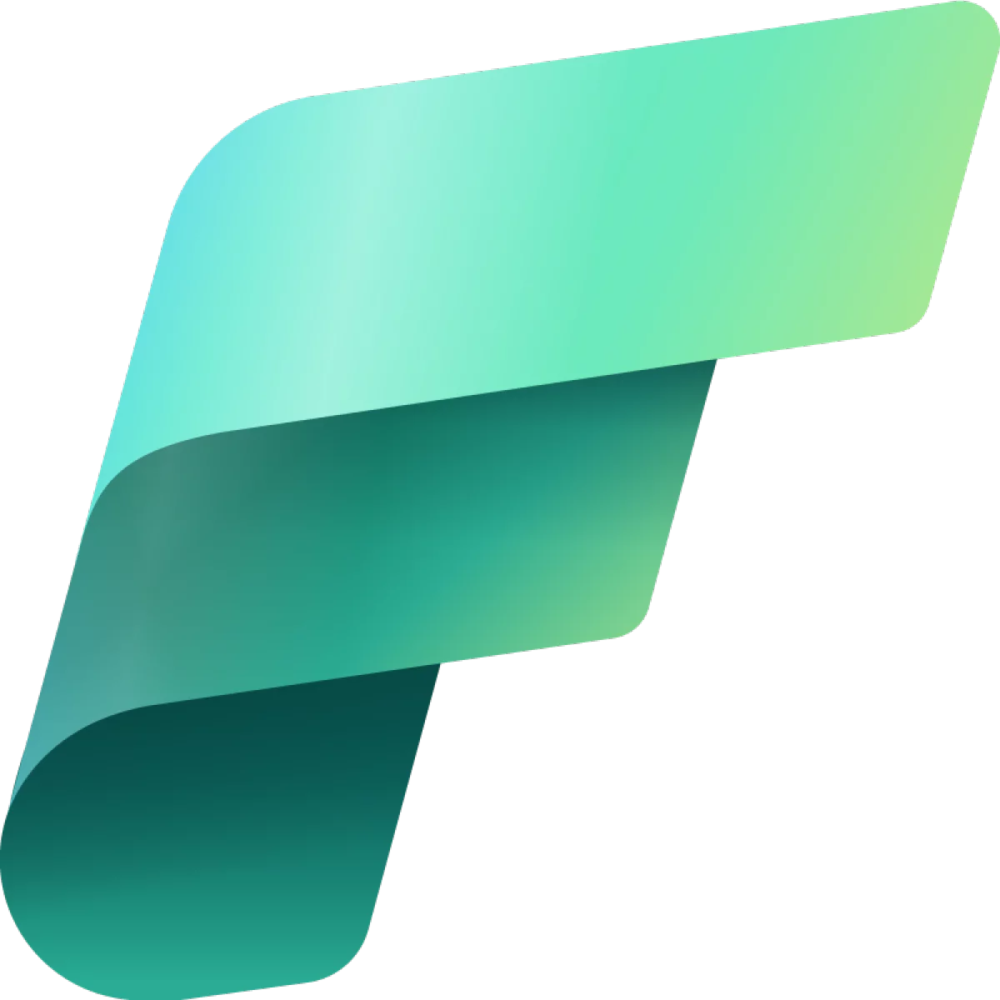

<p align="center">
  <h1 align="center">Medallion Retail Pipeline</h1>
  <p align="center">
    <strong>ETL Pipeline with Medallion Architecture (Bronze → Silver → Gold)</strong>
  </p>
  <p align="center">
    <a href="#architecture">Architecture</a> •
    <a href="#data-sources">Data Sources</a> •
    <a href="#data-cleaning-silver-layer">Cleaning</a> •
    <a href="#how-to-run">How to Run</a>
  </p>
</p>

<p align="center">
  
  
  
  
  
</p>

---

## Overview

An ETL data pipeline implementing the **Medallion Architecture** (Bronze → Silver → Gold) for retail data analysis. Built with Python, PySpark, and Microsoft Fabric.

<p align="center">
  
</p>

## Architecture

<p align="center">
  
</p>

---

## Tech Stack


---

## Data Sources

| File | Format | Description |
|------|--------|-------------|
| `orders_data.csv` | CSV | Customer orders with products, amounts, dates |
| `inventory_data.json` | JSON | Product inventory with stock levels, costs |
| `returns_data.xlsx` | Excel | Product returns with reasons, refund status |

---

## Data Cleaning (Silver Layer)

### Orders
- **Quantity**: Convert words to numbers (`"one"` → `1`)
- **Dates**: Standardize multiple formats → `YYYY-MM-DD`
- **Amounts**: Remove currency symbols (`$799`, `₹5000` → `799`, `5000`)
- **Status**: Normalize case (`delivrd` → `delivered`)
- **Email**: Validate format, set invalid to null

### Inventory
- **Stock**: Convert words to numbers (`"twenty"` → `20`)
- **Cost**: Remove currency symbols
- **Available**: Standardize boolean (`"YES"`, `"Y"` → `True`)

### Returns
- **Dates**: Standardize formats
- **Amounts**: Remove currency symbols
- **Status**: Normalize case

---

## Gold Layer (Joined Table)

```sql
SELECT *
FROM orders
LEFT JOIN returns ON orders.OrderID = returns.OrderID
LEFT JOIN inventory ON orders.ProductName = inventory.ProductName
```

> **Why LEFT JOIN?** Keep all orders, even if no return or no inventory match.

---

## Project Structure

```
01-Medallion-Retail-Pipeline/
├── README.md
├── data/
│   ├── bronze/           # Raw data (as-is)
│   │   ├── orders_data.csv
│   │   ├── inventory_data.json
│   │   └── returns_data.xlsx
│   ├── silver/           # Cleaned data
│   │   ├── orders_clean.csv
│   │   ├── inventory_clean.csv
│   │   └── returns_clean.csv
│   └── gold/             # Joined analytics table
│       └── gold_joined.csv
├── notebooks/
│   └── Medallion_Pipeline.ipynb
├── scripts/
│   ├── medallion_pipeline.py        # Python/Pandas version
│   └── medallion_pipeline_pyspark.py # PySpark/Fabric version
└── screenshots/
    └── (dashboard screenshots)
```

---

## How to Run

### Local (Python)
```bash
cd scripts
python medallion_pipeline.py
```

### Microsoft Fabric
1. Upload raw files to Lakehouse `/Files/bronze/`
2. Open `medallion_pipeline_pyspark.py` in Fabric Notebook
3. Run all cells
4. Gold table ready for Power BI

---

## KPIs Generated

- Total Revenue by Payment Mode
- Order Status Distribution
- Return Rate by Product
- Revenue by Promo Code

---

## Related Repositories

- [AWS Projects](https://github.com/lpalad/AWS-Projects) - AWS infrastructure and AI/ML projects

## Blog Posts

Related blog posts: [cloudhermit.com.au](https://www.cloudhermit.com.au)

---

## Author

<table>
  <tr>
    <td>
      <strong>Leonard S Palad</strong><br>
      MBA | Master of AI (In-progress)
    </td>
  </tr>
  <tr>
    <td>
      <a href="https://salesconnect.com.au/aip.html">AI Portfolio</a> •
      <a href="https://www.linkedin.com/in/leonardspalad/">LinkedIn</a> •
      <a href="https://www.cloudhermit.com.au/">Blog</a>
    </td>
  </tr>
</table>

---

<p align="center">
  <sub>Built with ❤️ using Python, PySpark and Microsoft Fabric</sub>
</p>
