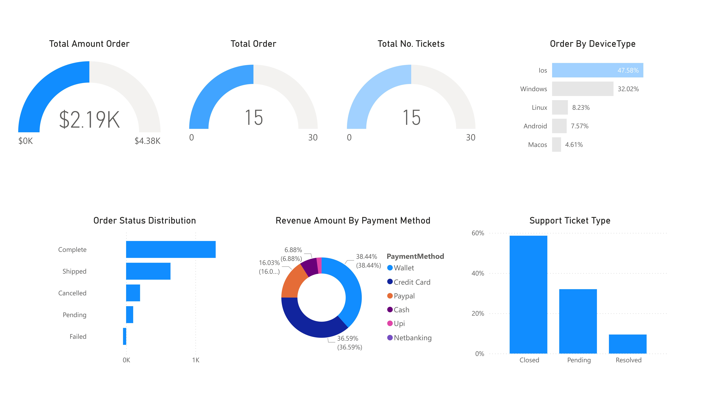

<p align="center">
  <h1 align="center">E-Commerce Customer 360 Pipeline</h1>
  <p align="center">
    <strong>Customer Analytics with Medallion Architecture (Bronze → Silver → Gold)</strong>
  </p>
  <p align="center">
    <a href="#architecture">Architecture</a> •
    <a href="#data-sources">Data Sources</a> •
    <a href="#data-cleaning-silver-layer">Cleaning</a> •
    <a href="#kpis-generated">KPIs</a> •
    <a href="#how-to-run">How to Run</a>
  </p>
</p>

<p align="center">
  
  
  
  
  
</p>

---

## Overview

A **Customer 360** analytics pipeline implementing the **Medallion Architecture** (Bronze → Silver → Gold). This project joins 5 data sources to create a unified customer view for analytics and KPI reporting.

<p align="center">
  
</p>

## Architecture

```
┌─────────────────────────────────────────────────────────────────────┐
│                    MEDALLION ARCHITECTURE                           │
│                    Customer 360 View                                │
├─────────────────────────────────────────────────────────────────────┤
│                                                                     │
│   BRONZE (Raw)           SILVER (Cleaned)         GOLD (Analytics)  │
│   ┌────────────┐        ┌────────────────┐       ┌──────────────┐  │
│   │ customers  │   →    │ customers_clean│   →   │              │  │
│   └────────────┘        └────────────────┘       │              │  │
│   ┌────────────┐        ┌────────────────┐       │              │  │
│   │ orders     │   →    │ orders_clean   │   →   │  gold_joined │  │
│   └────────────┘        └────────────────┘       │              │  │
│   ┌────────────┐        ┌────────────────┐       │  (LEFT JOIN  │  │
│   │ payments   │   →    │ payments_clean │   →   │   on         │  │
│   └────────────┘        └────────────────┘       │  CustomerID) │  │
│   ┌────────────┐        ┌────────────────┐       │              │  │
│   │ support_   │   →    │ support_       │   →   │              │  │
│   │ tickets    │        │ tickets_clean  │       │              │  │
│   └────────────┘        └────────────────┘       └──────┬───────┘  │
│   ┌────────────┐        ┌────────────────┐              │          │
│   │ web_       │   →    │ web_activities │   →          ▼          │
│   │ activities │        │ _clean         │       ┌──────────────┐  │
│   └────────────┘        └────────────────┘       │  Power BI    │  │
│                                                  │  Dashboard   │  │
│                                                  └──────────────┘  │
└─────────────────────────────────────────────────────────────────────┘
```

---

## Dashboard

<p align="center">
  
</p>

---

## Tech Stack


---

## Data Sources

| File | Description | Key Fields |
|------|-------------|------------|
| `customers.csv` | Customer master data | CustomerID, Name, Email, Gender, DOB, City |
| `orders.csv` | Order transactions | OrderID, CustomerID, Amount, Status, Date |
| `payments.csv` | Payment records | PaymentID, CustomerID, Method, Status, Amount |
| `support_tickets.csv` | Customer support issues | TicketID, CustomerID, IssueType, Resolution |
| `web_activities.csv` | Website browsing data | SessionID, CustomerID, PageViewed, Device |

---

## Data Cleaning (Silver Layer)

<details>
<summary><strong>Customers</strong></summary>

| Field | Cleaning Applied |
|-------|------------------|
| Name | Title Case (`john DOE` → `John Doe`) |
| Email | Validate format, lowercase, invalid → null |
| Gender | Standardize (`M`, `male`, `MALE` → `Male`) |
| DOB | Parse multiple date formats → `YYYY-MM-DD` |
| City | Title Case (`MUMBAI` → `Mumbai`) |

</details>

<details>
<summary><strong>Orders</strong></summary>

| Field | Cleaning Applied |
|-------|------------------|
| OrderDate | Parse multiple formats → `YYYY-MM-DD` |
| Amount | 2 decimal places, NaN → 0.00 |
| Status | Title Case (`shipped` → `Shipped`) |

</details>

<details>
<summary><strong>Payments</strong></summary>

| Field | Cleaning Applied |
|-------|------------------|
| PaymentDate | Parse multiple formats, NaN → blank |
| PaymentMethod | Merge duplicates (`creditcard` → `Credit Card`) |
| PaymentStatus | Title Case |
| Amount | 2 decimal places |

</details>

<details>
<summary><strong>Support Tickets</strong></summary>

| Field | Cleaning Applied |
|-------|------------------|
| IssueType | Title Case |
| TicketDate | Parse multiple formats |
| ResolutionStatus | Title Case |

</details>

<details>
<summary><strong>Web Activities</strong></summary>

| Field | Cleaning Applied |
|-------|------------------|
| PageViewed | Lowercase |
| SessionTime | Parse multiple formats |
| DeviceType | Title Case |

</details>

---

## Gold Layer (Joined Table)

```python
# Customer 360 View - All tables joined on CustomerID
gold = (
    customers
    .merge(orders, on='CustomerID', how='left')
    .merge(payments, on='CustomerID', how='left')
    .merge(support_tickets, on='CustomerID', how='left')
    .merge(web_activities, on='CustomerID', how='left')
)
```

> **Why LEFT JOIN?** Keep all customers, even if they have no orders, payments, tickets, or web activity.

---

## Project Structure

```
02-E-Commerce-Customer360/
├── README.md
├── data/
│   ├── bronze/           # Raw data (as-is)
│   │   ├── customers.csv
│   │   ├── orders.csv
│   │   ├── payments.csv
│   │   ├── support_tickets.csv
│   │   └── web_activities.csv
│   ├── silver/           # Cleaned data
│   │   ├── customers_clean.csv
│   │   ├── orders_clean.csv
│   │   ├── payments_clean.csv
│   │   ├── support_tickets_clean.csv
│   │   └── web_activities_clean.csv
│   └── gold/             # Joined analytics table
│       └── gold_joined.csv
├── notebooks/
│   └── E-com.ipynb       # Complete pipeline notebook
└── screenshots/
    ├── dashboard.jpg
    └── E-Com-Revenue-KPS.pdf
```

---

## How to Run

### Local (Python)
```bash
# Open Jupyter Notebook
jupyter notebook notebooks/E-com.ipynb
# Run all cells
```

### Microsoft Fabric
1. Upload raw files to Lakehouse `/Files/bronze/`
2. Copy PySpark code from notebook into Fabric Notebook
3. Run all cells
4. Gold table ready for Power BI

---

## KPIs Generated

| KPI | Chart Type |
|-----|------------|
| Total Revenue | Card |
| Total Orders | Gauge |
| Total Tickets | Gauge |
| Order by Device Type | Bar Chart |
| Order Status Distribution | Bar Chart |
| Revenue by Payment Method | Donut Chart |
| Support Ticket by Type | Bar Chart |

---

## Key Insights

- **iOS** dominates device usage (47.58%)
- **Credit Card** is the top payment method (38.44%)
- Most support tickets are **Closed** (50%+)
- Total revenue: **$2.19K** from **15 orders**

---

## Related Repositories

- [AWS Projects](https://github.com/lpalad/AWS-Projects) - AWS infrastructure and AI/ML projects

## Blog Posts

Related blog posts: [cloudhermit.com.au](https://www.cloudhermit.com.au)

---

## Author

<table>
  <tr>
    <td>
      <strong>Leonard S Palad</strong><br>
      MBA | Master of AI (In-progress)
    </td>
  </tr>
  <tr>
    <td>
      <a href="https://salesconnect.com.au/aip.html">AI Portfolio</a> •
      <a href="https://www.linkedin.com/in/leonardspalad/">LinkedIn</a> •
      <a href="https://www.cloudhermit.com.au/">Blog</a>
    </td>
  </tr>
</table>

---

<p align="center">
  <sub>Built with ❤️ using Python, PySpark and Microsoft Fabric</sub>
</p>
