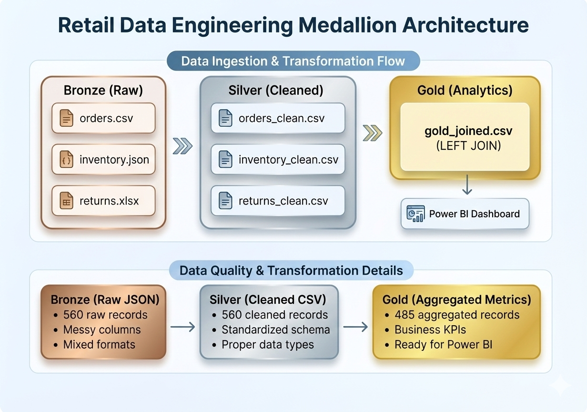
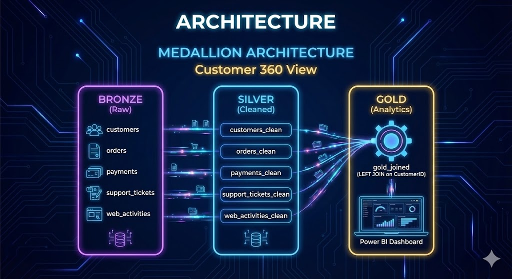
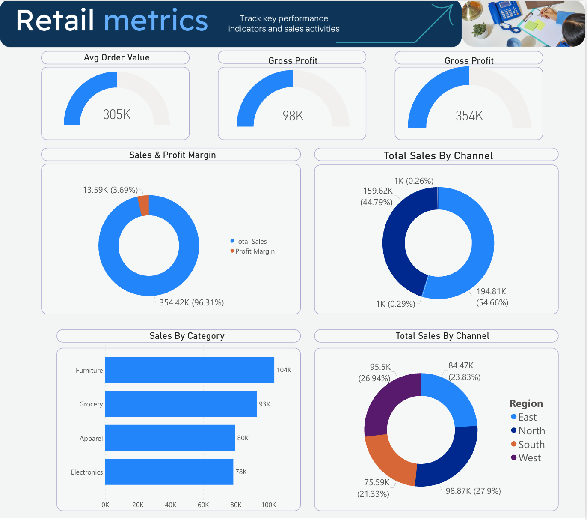

<p align="center">
  <h1 align="center">Retail Data Engineering Pipeline</h1>
  <p align="center">
    <strong>Medallion Architecture (Bronze → Silver → Gold) with PySpark on Microsoft Fabric</strong>
  </p>
  <p align="center">
    <a href="#architecture">Architecture</a> •
    <a href="#data-pipeline">Pipeline</a> •
    <a href="#power-bi-dashboard">Dashboard</a> •
    <a href="#how-to-run">How to Run</a>
  </p>
</p>

<p align="center">
  
  
  
  
</p>

---

## Overview

A retail data engineering pipeline that transforms raw retail transaction data into clean, aggregated business metrics ready for Power BI visualization. This project demonstrates the **Medallion Architecture** pattern commonly used in modern data lakehouses.

<p align="center">
  
</p>

## Architecture

<p align="center">
  
</p>

## Project Structure

<p align="center">
  
</p>

---

## Data Pipeline

### Bronze Layer (Raw Data)

> **Source:** `retail_raw_data_560.json` - 560 retail transactions with messy column names

<details>
<summary><strong>View Data Quality Issues</strong></summary>

| Raw Column | Issue |
|------------|-------|
| `Order iD` | Space in name, mixed case |
| `order_date` | Lowercase |
| `cust_ID` | Underscore, mixed case |
| `Cust Segment` | Space in name |
| `prodct_ID` | Misspelled "prodct" |
| `Prodct Category` | Misspelled, space |
| `prod_Name` | Underscore |
| `QTY` | Uppercase |
| `price_unit` | Underscore |
| `cost_unit` | Underscore |
| `channel` | Lowercase |
| `new customer` | Space, lowercase |
| `store type` | Space, lowercase |

</details>

### Silver Layer (Cleaned Data)

> **Transformations:** Column renaming, date parsing, numeric precision, text standardization

| Transformation | Details |
|----------------|---------|
| **Column Renaming** | Standardized to PascalCase (e.g., `Order iD` → `OrderID`) |
| **Date Format** | Standardized to DD-MM-YYYY |
| **Numeric Precision** | UnitPrice, CostPrice rounded to 2 decimals |
| **Text Standardization** | Channel, NewCustomer, StoreType → Title Case |
| **Data Types** | Proper casting (Integer, Double, Date) |

<details>
<summary><strong>View Clean Schema</strong></summary>

| Column | Type | Example |
|--------|------|---------|
| OrderID | Integer | 1000 |
| OrderDate | String | 26-03-2025 |
| CustomerID | String | C046 |
| CustomerSegment | String | Retail, Wholesale |
| Region | String | East, North, South, West |
| ProductID | String | P009 |
| ProductCategory | String | Furniture, Apparel, Electronics, Grocery |
| ProductName | String | Office Chair, T-Shirt, Jeans, USB Cable |
| Quantity | Integer | 1-10 |
| UnitPrice | Double | 54.77 |
| CostPrice | Double | 41.21 |
| Channel | String | In-Store, Online |
| NewCustomer | String | Yes, No |
| StoreType | String | Web, Mobile App, Flagship, Outlet |

</details>

### Gold Layer (Aggregated Metrics)

> **Dimensions:** Region, CustomerSegment, ProductCategory, Channel, StoreType, Year, Quarter, Month

| Metric | Calculation |
|--------|-------------|
| **TotalSales** | SUM(Quantity × UnitPrice) |
| **TotalCost** | SUM(Quantity × CostPrice) |
| **GrossProfit** | TotalSales - TotalCost |
| **OrderCount** | COUNT(OrderID) |
| **CustomerCount** | COUNT(DISTINCT CustomerID) |
| **AvgOrderValue** | TotalSales / OrderCount |
| **TotalQuantity** | SUM(Quantity) |
| **ProfitMargin** | (GrossProfit / TotalSales) × 100 |

---

## Power BI Dashboard

<p align="center">
  
</p>

### DAX Measures

```dax
Total Revenue = SUM(retail_metrics[TotalSales])
Total Cost = SUM(retail_metrics[TotalCost])
Gross Profit = SUM(retail_metrics[GrossProfit])
Total Orders = SUM(retail_metrics[OrderCount])
Profit Margin % = DIVIDE(SUM(retail_metrics[GrossProfit]), SUM(retail_metrics[TotalSales])) * 100
Avg Order Value = DIVIDE(SUM(retail_metrics[TotalSales]), SUM(retail_metrics[OrderCount]))
```

### Suggested Visuals

| Visual | Dimension | Metric |
|--------|-----------|--------|
| Bar Chart | Region | TotalSales |
| Bar Chart | ProductCategory | GrossProfit |
| Donut Chart | CustomerSegment | TotalSales |
| Donut Chart | Channel | OrderCount |
| Line Chart | Month | TotalSales (trend) |
| Table | All dimensions | All metrics |

---

## Tech Stack


---

## Scripts

### bronze_to_silver.py

```python
# Key transformations
df_silver = (
    df_bronze
    .withColumnRenamed("Order iD", "OrderID")
    .withColumnRenamed("order_date", "OrderDate")
    # ... more renames
    .withColumn("OrderDate", date_format(to_date(col("OrderDate"), "dd-MM-yyyy"), "dd-MM-yyyy"))
    .withColumn("UnitPrice", spark_round(col("UnitPrice").cast(DoubleType()), 2))
    .withColumn("Channel", initcap(col("Channel")))
    # ... more transformations
)
```

### silver_to_gold.py

```python
# Key aggregations
df_gold = (
    df_enriched
    .groupBy("Region", "CustomerSegment", "ProductCategory", "Channel", "StoreType", "Year", "Quarter", "Month")
    .agg(
        spark_round(spark_sum("SalesAmount"), 2).alias("TotalSales"),
        spark_round(spark_sum("CostAmount"), 2).alias("TotalCost"),
        spark_round(spark_sum("SalesAmount") - spark_sum("CostAmount"), 2).alias("GrossProfit"),
        count("OrderID").alias("OrderCount"),
        countDistinct("CustomerID").alias("CustomerCount"),
        # ... more aggregations
    )
)
```

---

## How to Run

### Local (Development)

```bash
# Requires PySpark installed
cd 04-Retail-Data-Engineering
spark-submit scripts/bronze_to_silver.py
spark-submit scripts/silver_to_gold.py
```

### Microsoft Fabric (Production)

1. Upload `retail_raw_data_560.json` to Lakehouse `Files/bronze/`
2. Open notebook in Fabric
3. Update paths to Lakehouse paths
4. Run cells sequentially

---

## Data Summary

| Layer | Records | File |
|:------|:-------:|:-----|
| **Bronze** | 560 | `retail_raw_data_560.json` |
| **Silver** | 560 | `retail_clean.csv` |
| **Gold** | 485 | `retail_metrics.csv` |

---

## Related Repositories

- [AWS Projects](https://github.com/lpalad/AWS-Projects) - AWS infrastructure and AI/ML projects

## Blog Posts

Related blog posts: [cloudhermit.com.au](https://www.cloudhermit.com.au)

---

## Author

<table>
  <tr>
    <td>
      <strong>Leonard S Palad</strong><br>
      MBA | Master of AI (In-progress)
    </td>
  </tr>
  <tr>
    <td>
      <a href="https://salesconnect.com.au/aip.html">AI Portfolio</a> •
      <a href="https://www.linkedin.com/in/leonardspalad/">LinkedIn</a> •
      <a href="https://www.cloudhermit.com.au/">Blog</a>
    </td>
  </tr>
</table>

---

<p align="center">
  <sub>Built with ❤️ using PySpark and Microsoft Fabric</sub>
</p>
